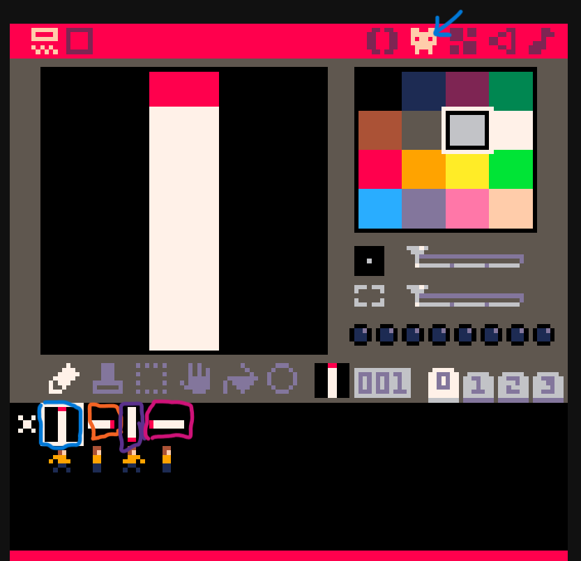

# Animations Uppgift

## Uppgiften

Med denna uppgiften så kommer ni att lära er att animera en sprite med 4 stycken bilder.

## Steg 1

Kopiera koden från [animations.p8](/tree/main/animations/animations.p8)

## Steg 2

Välj fliken för att skapa nya sprites och skapa 4 stycken sprites på platserna 1, 2, 3, och 4 markerade med olika färger på bilden.

## Steg 3

Kör koden och tänk på att bilderna kommer att spelas upp som de ligger i sprite fliken från vänster till höger.